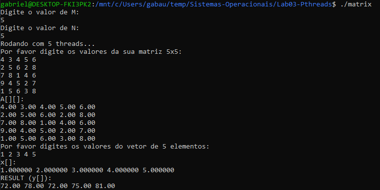

# Multiplicação de matriz-vetor em pthreads

# Descrição
Esse programa realiza a multiplicação entre um vetor e uma matriz informada pelo usuário, utilizando a biblioteca posix threads para atingir tal objetivo.

# Como rodar: 
Dentro da pasta com o código fonte, execute:
```
make
./matrix
```

# Exemplo de utilização e resultado:
```
$ ./matrix
Digite o valor de M:
5
Digite o valor de N:
5
Rodando com 5 threads...
Por favor digite os valores da sua matriz 5x5:
4 3 4 5 6
2 5 6 2 8
7 8 1 4 6
9 4 5 2 7
1 5 6 3 8
A[][]:
4.00 3.00 4.00 5.00 6.00
2.00 5.00 6.00 2.00 8.00
7.00 8.00 1.00 4.00 6.00
9.00 4.00 5.00 2.00 7.00
1.00 5.00 6.00 3.00 8.00
Por favor digites os valores do vetor de 5 elementos:
1 2 3 4 5
x[]:
1.000000 2.000000 3.000000 4.000000 5.000000
RESULT (y[]):
72.00 78.00 72.00 75.00 81.00
```
